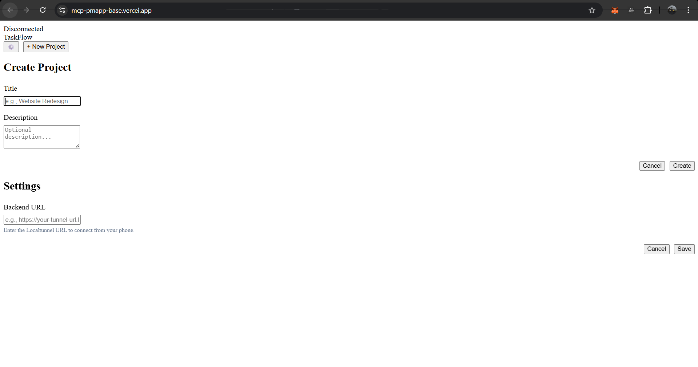

# Vercel Prod Issue

**Description:**

There is an "Uncaught SyntaxError: Unexpected token '<'" error in the Vercel production environment. This is likely due to a misconfiguration in the server-side routing, causing an HTML file to be served instead of a JavaScript file.

**Image of the issue:**



**Solution:**
The issue is in the `server.js` file. The solution is to add the correct content type for the `.js` files in the production environment.

```javascript
app.get('/*.js', (req, res, next) => {
    if (process.env.NODE_ENV === 'production') {
        res.type('text/javascript');
    }
    next();
});
```

same eroro when i run exicute form the web ima able to user all the tools form the cli but when i also will be able to add project and all that things are vorking good on web too but only isse is in exicute on loading the cli lancher starts and says 

[2025-12-03T19:25:01.726Z] Launcher started...
E: Task App running at http://localhost:3000
 and on the web ther is an error popoing up its in the Request URL
https://aibdxsebwhalbnugsqel.supabase.co/auth/v1/token?grant_type=refresh_token
Request Method
POST
Status Code
400 Bad Request
Remote Address
172.64.149.246:443
Referrer Policy
strict-origin-when-cross-origin

and on clicking exicute the api Request URL
http://localhost:3000/api/tasks/34/execute
Referrer Policy
strict-origin-when-cross-origin
is called and at that time the error log @mcp_error.log shows
[2025-12-03T19:29:00.225Z] Launcher started...
ERROR: node:events:502
      throw er; // Unhandled 'error' event
      ^

Error: listen EADDRINUSE: address already in use :::3000
    at Server.setupListenHandle [as _listen2] (node:net:1937:16)
    at listenInCluster (node:net:1994:12)
    at Server.listen (node:net:2099:7)
    at file:///C:/Users/jobin/project/pocs/pmapp/mcp-pmapp-base/server.js:234:8
    at ModuleJob.run (node:internal/modules/esm/module_job:271:25)
    at async onImport.tracePromise.__proto__ (node:internal/modules/esm/loader:547:26)
    at async asyncRunEntryPointWithESMLoader (node:internal/modules/run_main:116:5)
Emitted 'error' event on WebSocketServer instance at:
    at Server.emit (node:events:524:28)
    at emitErrorNT (node:net:1973:8)
    at process.processTicksAndRejections (node:internal/process/task_queues:90:21) {
  code: 'EADDRINUSE',
  errno: -4091,
  syscall: 'listen',
  address: '::',
  port: 3000
}

Node.js v22.13.1
Process exited with code: 1

