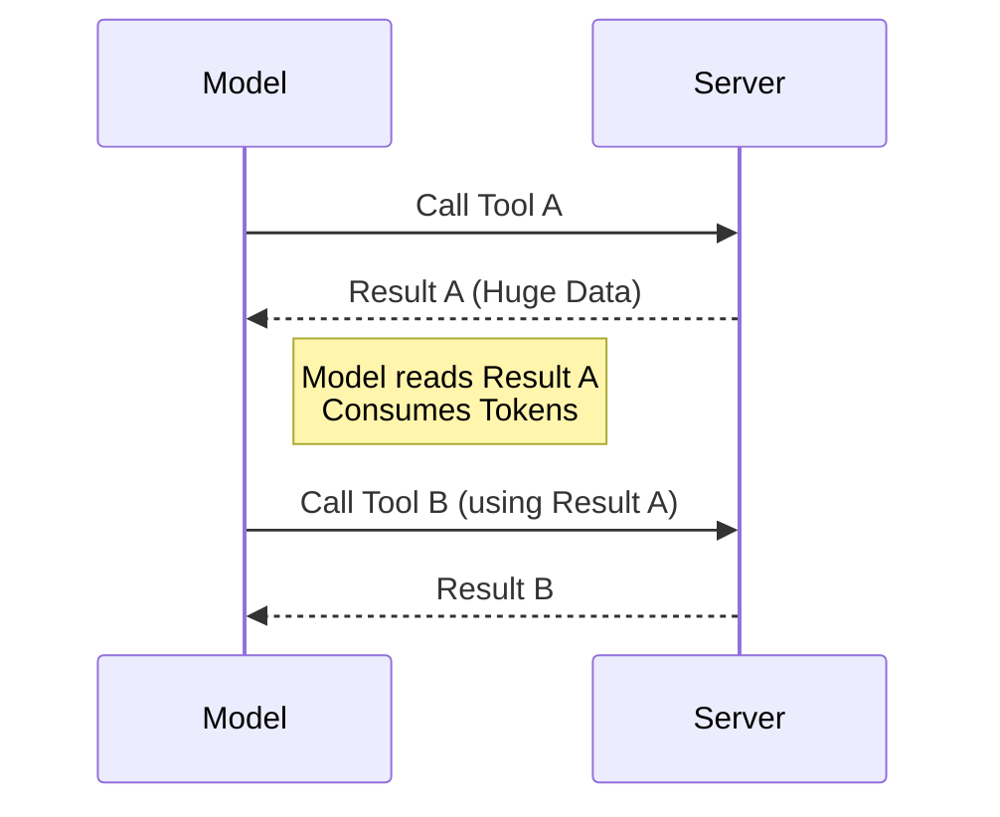
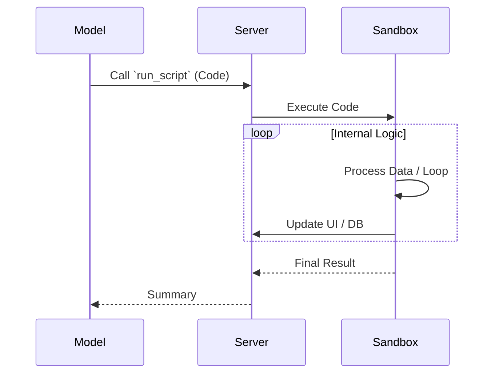

# Workflow Comparison: Standard Tool Calling vs. Code Execution with MCP

This document details the architectural evolution from the standard "Individual Tool Calling" pattern to the efficient "Code Execution" pattern implemented in this project.

## 1. Before Implementation: Standard Tool Calling

In the standard MCP workflow, the model acts as an orchestrator that calls tools one by one. Data must travel back and forth between the model and the server for every single step.

### Characteristics
- **High Token Usage**: Intermediate results (like large datasets or file contents) must be returned to the model's context window to be used in the next step.
- **High Latency**: Each step requires a full network round-trip (Model → Tool → Model → Tool).
- **Fragile Logic**: Loops and conditionals are managed by the model "deciding" the next step, which can be inconsistent.

### Conceptual Example
To count from 1 to 5, the model would need to generate 5 separate responses:

```javascript
// Turn 1
Model: Call tool `update_count(1)`
Server: Returns "Displayed 1"

// Turn 2
Model: Call tool `update_count(2)`
Server: Returns "Displayed 2"

// ... (Repeats 5 times)
```

### Data Flow Diagram


---

## 2. Implemented Workflow: Code Execution

The implemented workflow follows the "Code Execution" pattern (as described by Anthropic). The model writes a single script that executes logic within a sandboxed environment on the server.

### Characteristics
- **Minimal Token Usage**: Intermediate data stays in the sandbox. The model only sees the final result or specific logs it requests.
- **Low Latency**: Complex logic (loops, filtering, waiting) happens in a single round-trip.
- **Robust Control Flow**: Standard JavaScript constructs (`for`, `while`, `if`) are used for logic, guaranteeing precise execution.

### Implemented Example (`server.js`)
The model sends a **single** block of code to the `run_script` tool. The server executes it using Node.js `vm`.

```javascript
// SINGLE Turn
Model: Call tool `run_script` with code:
"""
(async () => {
    for (let i = 1; i <= 5; i++) {
        console.log(`Step ${i}`);
        await update_count(i); // Pauses here for UI synchronization
    }
})();
"""

// Server executes the entire loop. 
// No intermediate tokens are used for the loop steps.
```

### Data Flow Diagram


## Key Differences

| Feature | Standard Tool Calling (Before) | Code Execution (Implemented) |
| :--- | :--- | :--- |
| **Context Efficiency** | **Low**: All intermediate data bloats context. | **High**: Data stays in sandbox; only code & summary are exchanged. |
| **Latency** | **High**: Multi-turn ping-pong. | **Low**: Single-turn execution. |
| **Logic Handling** | Probabilistic (LLM decides next step). | Deterministic (Code defines exact logic). |
| **Complexity** | Simple tool definitions. | Requires a sandbox (`vm`) and exposed API. |

### Why This Matters
For this specific "Counter POC", the Code Execution pattern allows the script to **wait** for the frontend animation (`await update_count(...)`) without blocking the LLM or requiring the LLM to poll for status. The script maintains the state and synchronization, which would be extremely difficult and token-expensive to manage with individual tool calls.
